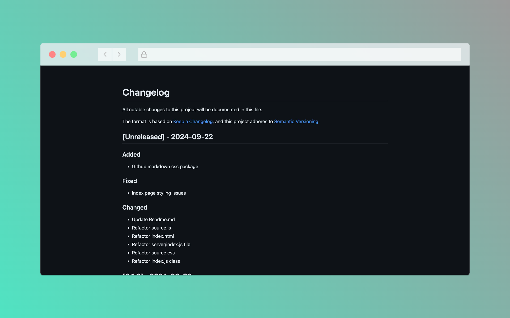
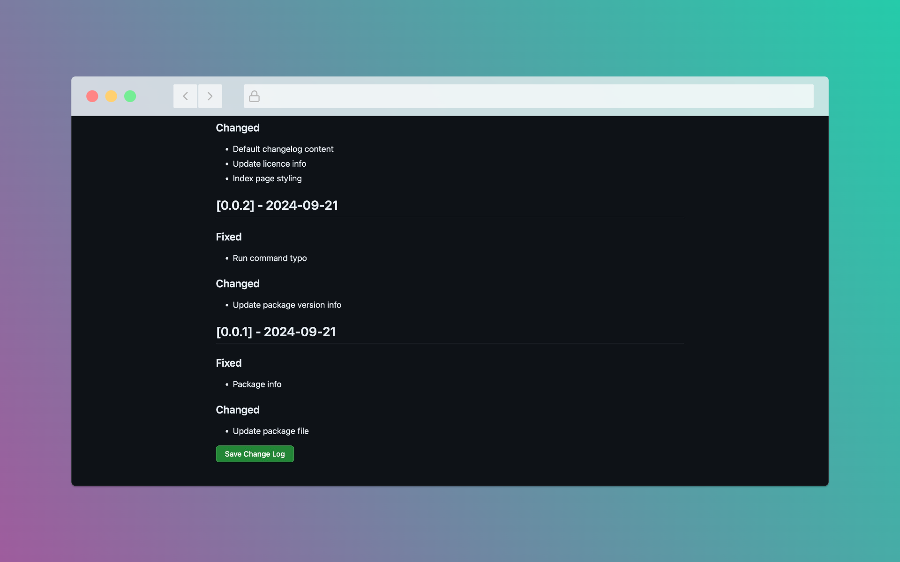

# Semantic Auto Changelog

This package is a fork of [changelog-helper](https://github.com/RyanZim/changelog-helper), with a key difference: it's automated. Instead of manually writing changelogs, this tool generates them from your git commit history. The tool adheres to a simplified version of the [Keep a Changelog](https://keepachangelog.com/en/1.0.0/) style and uses [Semantic Versioning](https://semver.org/).

After the changelog is generated, you can optionally manually edit each entry through an intuitive browser interface, giving you full control over the final result.

## Features
- **Automated Changelog Generation**: Automatically generate a changelog based on your repository's git commit history.
- **Manual Editing Option**: After the changelog is generated, you can manually edit each entry if needed.
- **Follows Semantic Versioning**: Ensures that your changelog entries follow semver conventions.
- **Browser Interface**: Easy-to-use browser interface built with Vue, using Primer CSS for styling and GitHub Markdown for rendering.

## Screenshot



## Commit Message Format

For this package to work properly, your git commit messages must follow a specific format. This format ensures that the tool can correctly categorize and structure your changelog.

The required format is:

```
[commit-type]: [your commit message]
```

### Supported `commit-type` values:
- **Added**: Use this for new features or additions.
- **Changed**: Use this for modifications, updates, or changes in functionality.
- **Fixed**: Use this for bug fixes or corrections.
- **Removed**: Use this for features or functionality that have been removed.

### Example Commit Messages:
- `Added: Implemented user login functionality`
- `Changed: Updated dependencies to latest versions`
- `Fixed: Resolved issue with API timeout`
- `Removed: Deprecated authentication method`

By following this format, the changelog will be organized clearly and accurately reflect the changes in your project.

## Installation

```bash
npm install -g semantic-auto-changelog
```

## Usage

In your project directory, run:

```bash
semantic-auto-changelog
```

The tool will open a browser interface where you can preview and edit the generated changelog. Once you're satisfied, click **"Write to CHANGELOG.md"** to save the changelog, which will either prepend the new entries or create the file if it doesn't exist.

## How to Contribute

Contributions are welcome! Here’s how you can help:

1. **Fork the repository**: Click the "Fork" button at the top of this page to make a copy of this repo to your own GitHub account.
2. **Clone the repository**: Once you’ve forked the repo, clone it to your local machine.
    ```bash
    git clone https://github.com/YOUR-USERNAME/semantic-auto-changelog.git
    ```
3. **Create a branch**: Create a new branch for your feature or bugfix.
    ```bash
    git checkout -b my-new-feature
    ```
4. **Make your changes**: Implement your changes in the code, and be sure to follow the project’s coding standards.
5. **Commit your changes**: Ensure your commit messages follow the required format: `[commitType]: [commitMessage]`.
    ```bash
    git commit -m "Added: Your detailed commit message"
    ```
6. **Push to your branch**: Push your changes to your GitHub repository.
    ```bash
    git push origin my-new-feature
    ```
7. **Open a pull request**: Go to the original repository and click the "Pull Request" button to submit your changes for review.

Thank you for your contributions!
